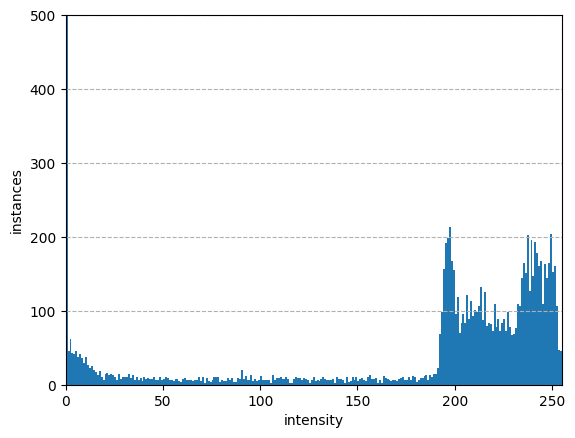
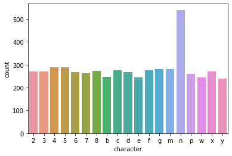

# CAPTCHA Images
____
## Цель
____
> Повысить безопасноть в интернете распозновая изображения CAPTCHA.
## Задачи
____
1. - [ ] анализ существующих решений.
2. - [ ] сбор данных и их обновление.
3. - [ ] обучение и оценка моделей на исходном датасете.
4. - [ ] выбор двух моделей с наибольшим значением точности.
5. - [ ] оценка качества и скорости работы модели на новых CAPTCHA путем A / B тестирования.
6. - [ ] выбор и развертывание наилучшей модели.
## [Датасет]([https://www.kaggle.com/datasets/rohitgr/wikitext](https://www.kaggle.com/datasets/fournierp/captcha-version-2-images))
____

## Целесообразность
____
Этот набор данных содержит изображения CAPTCHA (полностью автоматизированный общедоступный тест Тьюринга, позволяющий различать компьютеры и людей). Создан в 1997 году, чтобы пользователи могли идентифицировать и блокировать ботов (для предотвращения спама, DDOS и т. д.).    
Содержание
Изображения представляют собой слова из 5 букв, которые могут содержать цифры. К изображениям был применен шум (размытие и линия). Они имеют размер 200 на 50.
[Обзор датасета](https://www.researchgate.net/publication/248380891_captcha_dataset)

Можно посмотреть на пример гистограммы интенсивности. Обратите внимание
разрыв между интенсивностью около 0 (передний план) и
255 (фон) 

Если взглянуть на символы на изображениях CAPTCHA, можно заметить, что:

* используются только 19 символов 2,3,4,5,6,7,8 и b,c,d,e,f,g,m,n,p,w,x,y
* частота каждого символа примерно одинакова, за одним исключением: n используется в два раза чаще, чем другие символы. 

Эти данные можно применить для машинного обучения нейросети распознование симвлов 
